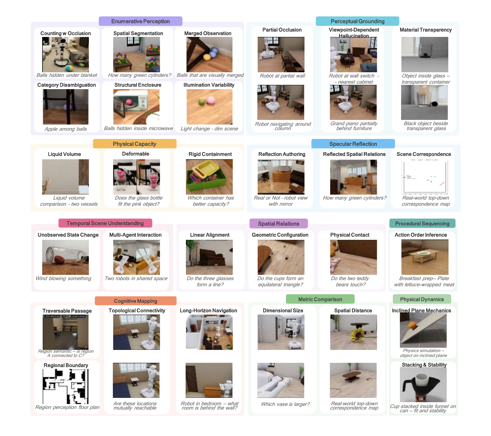

<div align="center">

<h1>ESI-Bench: Towards Embodied Spatial Intelligence<br>that Closes the Perception-Action Loop</h1>

<p>
  <a href="https://arxiv.org/abs/XXXX.XXXXX"></a>
  <a href="https://esi-bench.github.io/"></a>
  <a href="https://huggingface.co/datasets/esi-bench/ESI-Bench"></a>
  <a href="https://github.com/esi-bench/esi-bench/blob/main/LICENSE"></a>
</p>

<p>
  <strong>Yining Hong*</strong><sup>1</sup> &nbsp;
  <strong>Jiageng Liu*</strong><sup>2</sup> &nbsp;
  <strong>Han Yin</strong><sup>1</sup> &nbsp;
  <strong>Manling Li</strong><sup>3</sup> &nbsp;
  <strong>Leonidas Guibas</strong><sup>1</sup> &nbsp;
  <strong>Fei-Fei Li</strong><sup>1</sup> &nbsp;
  <strong>Jiajun Wu</strong><sup>1</sup> &nbsp;
  <strong>Yejin Choi</strong><sup>1</sup>
</p>

<p>
  <sup>1</sup>Stanford University &nbsp;
  <sup>2</sup>UCLA &nbsp;
  <sup>3</sup>Northwestern University
</p>


</div>

---

<p align="center">
  
</p>

## Overview

Spatial intelligence unfolds through a perception-action loop: agents act to acquire observations, and reason about how observations vary as a function of action. Rather than passively processing what is *seen*, they actively uncover what is *unseen* — occluded structure, dynamics, containment, and functionality that cannot be resolved from passive sensing alone.

**ESI-Bench** moves beyond prior formulations of spatial intelligence that assume oracle observations by recasting the observer as an actor. We introduce a comprehensive benchmark for embodied spatial intelligence spanning **10 task categories** and **29 subcategories** built on [OmniGibson](https://behavior.stanford.edu/omnigibson/), grounded in Spelke's core knowledge systems. Agents must decide what abilities to deploy — perception, locomotion, and manipulation — and how to sequence them to actively accumulate task-relevant evidence.

### Key Findings

- **Active exploration substantially outperforms passive counterparts**, with agents spontaneously discovering emergent spatial strategies without explicit instruction.
- **Passive multi-view adds noise rather than signal** despite consuming far more images.
- **Most failures stem from action blindness**: poor action choices lead to poor observations, which drive cascading errors.
- **Explicit 3D grounding stabilizes reasoning** on depth-sensitive tasks, but imperfect reconstruction proves more harmful than 2D baselines.
- **Models exhibit a metacognitive gap**: unlike humans who seek falsifying viewpoints and revise beliefs under contradiction, models commit prematurely with high confidence regardless of evidence quality.

---

## Repository Structure

```
esi-bench/
├── dataset/
│   └── json_clean/                    # Task question JSONs
│       ├── Action Sequencing/
│       ├── Cognitive Mapping/
│       ├── Enumerative Perception/
│       ├── Metric Comparison/
│       ├── Perceptual Grounding/
│       ├── Physical Dynamics/
│       ├── Physical Structure/
│       ├── Spatial Relations/
│       ├── Specular Reflection/
│       └── Temporal Understanding/
├── src/
│   ├── active_explore/                # Active exploration runner
│   │   ├── main.py
│   │   └── tasks/                     # Per-task modules
│   └── dataset_generation/            # Dataset construction scripts
│       └── (see Dataset Generation section below)
├── outputs/                           # Results and step images (git-ignored)
└── README.md
```

---

## Active Exploration

The active exploration module loads an OmniGibson scene, captures step images, calls a GPT or Gemini model, and writes an `answer.json`.

### Environment Setup

Use the existing `behavior` conda environment:

```bash
source ~/miniconda3/etc/profile.d/conda.sh
conda activate behavior
```

Set one API key depending on the provider:

```bash
export OPENAI_API_KEY=...
export GEMINI_API_KEY=...
```

OmniGibson and BEHAVIOR-1K assets are expected to be available from the conda environment and local machine setup.

### Running the Explorer

Run from the repository root:

```bash
python src/main.py \
  --task counting \
  --metadata "dataset/json_clean/Enumerative Perception/Spatial Segmentation/Merom_0_int/living_room_0/q_000.json" \
  --provider gemini \
  --model gemini-3.1-pro-preview \
  --max-steps 30 \
  --min-steps 1 \
  --threshold 0.9 \
  --results-root outputs/results \
  --step-image-root outputs/steps \
  --overwrite
```

For GPT:

```bash
python src/main.py \
  --task cognitivemap \
  --metadata "dataset/json_clean/Cognitive Mapping.json" \
  --question-index 0 \
  --provider gpt \
  --model gpt-5 \
  --max-steps 30 \
  --min-steps 1 \
  --threshold 0.9 \
  --results-root outputs/results \
  --step-image-root outputs/steps \
  --overwrite
```

`--metadata` can be a single canonical question JSON under `dataset/json_clean`, or a big-task summary JSON such as `dataset/json_clean/Cognitive Mapping.json` containing `json_paths`. Use `--question-index` to select from a summary list. The older raw `dataset/json` tree is kept as source data; new runner inputs should use `dataset/json_clean`.

See [`docs/run_tasks.md`](docs/run_tasks.md) for the per-small-task `--task`, summary JSON, and example `--question-index` mapping.

### Task Names

`--task` names are the module names under `src/active_explore/tasks`:

```text
action, angle_confusion, cognitivemap, counting, deformable, distance,
line, mirror, multiagent, occlusion, pour, size, slope, stacking,
storage, touching, transparent, triangle, unobserved_changes
```

The input JSON directories follow the ESI-Bench table categories:

```text
Action Sequencing, Cognitive Mapping, Enumerative Perception,
Metric Comparison, Perceptual Grounding, Physical Dynamics,
Physical Structure, Spatial Relations, Specular Reflection,
Temporal Understanding
```

### Output Format

The runner writes:

- `answer.json` under `--results-root`
- `step_*.png` under `--step-image-root`

> **Note:** Smoke tests were run with `max_steps=1`, which verifies environment loading, rendering, model calls, and result writing. It is not a full accuracy evaluation for tasks that need multi-step physical interaction.

---

## Dataset Generation

Dataset construction scripts for all task categories live under [`src/dataset_generation/`](src/dataset_generation/). Each task folder contains a Python script and a corresponding bash runner. To generate data, activate the `behavior` environment and run the bash script for the task you want:

```bash
source ~/miniconda3/etc/profile.d/conda.sh
conda activate behavior

# Example: generate occlusion data
bash src/dataset_generation/task_hallucination/batch_occlusion_yining.sh

# Example: generate slope/stacking data
bash src/dataset_generation/task_physics/batch_slope.sh
bash src/dataset_generation/task_physics/batch_stack.sh
```

Set your API key before running any script that calls a model:

```bash
export OPENAI_API_KEY=...
export GEMINI_API_KEY=...
```

The task folders and their scripts are:

| Folder | Scripts |
|---|---|
| `task_action_sequencing` | `batch_action` |
| `task_capacity` | `batch_pour`, `batch_storage`, `batch_storage_multi`, `batch_water` |
| `task_cognitive_map` | `batch_cognitivemap_connect`, `batch_cognitivemap_merge`, `batch_cognitivemap_plan`, `batch_cognitivemap_region` |
| `task_comparison` | `batch_distance`, `batch_size`, `batch_size_robot` |
| `task_confusing_relation` | `batch_equilateral`, `batch_isosceles`, `batch_randomtriangle`, `batch_line`, `batch_line_positive`, `batch_touching`, `batch_touching_false`, `batch_touching_real` |
| `task_counting` | `batch_counting_merge` |
| `task_deformable` | `batch_deformable` |
| `task_hallucination` | `batch_angle_confusion`, `batch_angle_confusion_yining`, `batch_dependency`, `batch_occlusion`, `batch_occlusion_yining`, `batch_transparent`, `batch_transparent_false` |
| `task_mirror` | `batch_mirror_correspondence`, `batch_mirror_distance`, `batch_mirror_merge`, `batch_mirror_object_reality` |
| `task_multi_agent` | `batch_multi_agent` |
| `task_physics` | `batch_slope`, `batch_stack` |
| `task_unobserved_changes` | `batch_unobserved_changes` |

---

## Citation

If you find ESI-Bench useful in your research, please cite:

```bibtex
@inproceedings{hong2026esibench,
  title     = {{ESI-Bench}: Towards Embodied Spatial Intelligence that Closes the Perception-Action Loop},
  author    = {Hong, Yining and Liu, Jiageng and Yin, Han and Li, Manling and Guibas, Leonidas and Li, Fei-Fei and Wu, Jiajun and Choi, Yejin},
  year      = {2026}
}
```

We also build on BEHAVIOR-1K and OmniGibson. Please cite them as well:

```bibtex
@inproceedings{li2023behavior1k,
  title     = {{BEHAVIOR-1K}: A Benchmark for Embodied {AI} with 1,000 Everyday Activities and Realistic Simulation},
  author    = {Li, Chengshu and Zhang, Ruohan and Wong, Josiah and Gokmen, Cem and Srivastava, Sanjana and Mart{\'i}n-Mart{\'i}n, Roberto and Wang, Chen and Levine, Gabrael and Lingelbach, Michael and Sun, Jiankai and Anvari, Mona and Hwang, Minjune and Sharma, Manasi and Aydin, Arman and Bansal, Dhruva and Hunter, Samuel and Kim, Kyu-Young and Lou, Alan and Matthews, Caleb R and Villa-Renteria, Ivan and Tang, Jerry Huayang and Tang, Claire and Xia, Fei and Savarese, Silvio and Gweon, Hyowon and Liu, Karen and Wu, Jiajun and Fei-Fei, Li},
  booktitle = {Proceedings of The 6th Conference on Robot Learning},
  series    = {Proceedings of Machine Learning Research},
  volume    = {205},
  pages     = {80--93},
  publisher = {PMLR},
  year      = {2023}
}

@inproceedings{li2022omnigibson,
  title     = {{OmniGibson}: A Platform for Accelerating Embodied {AI} Research Built upon {NVIDIA}'s Omniverse Engine},
  author    = {Li, Chengshu and Gokmen, Cem and Lingelbach, Michael and Srivastava, Sanjana and Mart{\'i}n-Mart{\'i}n, Roberto and Ber, Daniel and Shen, William and Hirose, Noriaki and Zhang, Ruohan and Liu, Karen and Gweon, Hyowon and Savarese, Silvio and Fei-Fei, Li and Wu, Jiajun},
  booktitle = {Proceedings of The 6th Conference on Robot Learning},
  year      = {2022}
}
```

---

## License

This project is licensed under the MIT License. See [LICENSE](LICENSE) for details.

---

<div align="center">
  <sub>Built on <a href="https://behavior.stanford.edu/omnigibson/">OmniGibson</a> · Stanford University · UCLA · Northwestern University</sub>
</div>
